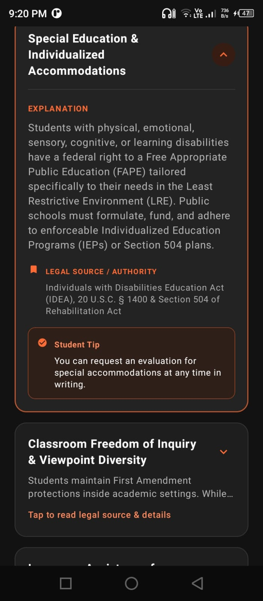

 # 📚 Know Your Rights

> An offline Android app that teaches students worldwide about their rights — 
> using only verified content from international sources like the UN, UNESCO, 
> and UNICEF. No AI guesses. Just facts.

Built for **LexHack 2026** 🏛️

---

## 🎯 The Problem

Most students don't know their basic rights — the right to education, 
privacy, fair treatment, or disability support. This information usually 
lives in dense, hard-to-read legal documents (UN conventions, UNESCO 
papers). Asking a general AI chatbot isn't reliable either — answers vary 
and aren't always verifiable against real sources.

## 💡 The Solution

**Know Your Rights** organizes authentic international student rights into 
4 simple categories, written in plain language, with every single right 
cited back to its verified source — so students get information they can 
actually trust.

## ✨ Features

- 📖 **4 Rights Categories**
  - Right to Learn — education access, non-discrimination, disability inclusion
  - Right to Privacy — student data protection & records safety
  - Right to Fair Treatment — due process, non-discrimination, dignity
  - Right to Support — accessibility, accommodations, safety
- 🔍 Search rights by keyword or source
- 🔖 Bookmark important rights for quick access
- 📊 Track learning progress
- 🔐 Simple local login/signup (fully offline)
- 🎨 Smooth animations and a clean dark UI

## 📜 Verified Sources

Every right in the app is sourced from:
- Universal Declaration of Human Rights (Article 26)
- UNESCO Convention against Discrimination in Education (1960)
- UN Convention on the Rights of the Child (Articles 23, 28–30)
- UN Convention on the Rights of Persons with Disabilities (Article 24)
- UNICEF EdTech Data Privacy Guidelines

No content is AI-generated or assumed — everything is drawn directly from 
these official documents.

## 🛠️ Tech Stack

- **Kotlin**
- **Jetpack Compose** — modern declarative UI
- **Room Database** — local, offline account storage
- **Claude AI (Anthropic)** — used to assist with writing and debugging code

## 🚀 How to Run

1. Clone this repository
 . git clone https://github.com/noor3113/know-your-rights
2. Open the project in **Android Studio**
3. Let Gradle sync
4. Run on an emulator or physical Android device

## 📱 Screenshots

### Home Screen

### Rights List

### Right Detail

### Sign Up

## 🎥 Demo Video

*(https://youtube.com/shorts/pSzcilpAVSM?si=YADmzeT11zCOCa-_)*

## 🧑‍💻 Built By

*(Noor ul Huda)* — Solo project for LexHack 2026

## 📄 License

This project was built for educational and hackathon purposes.
